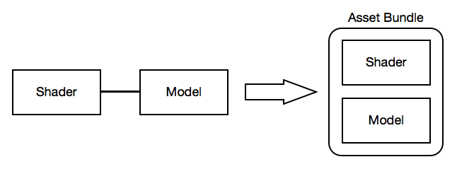
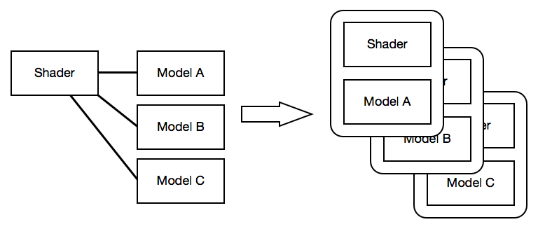
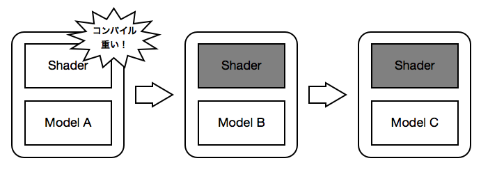
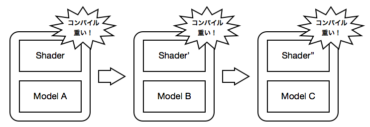
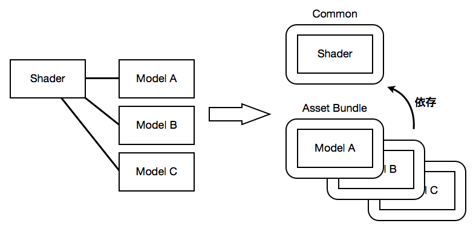
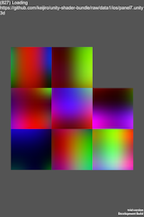

アセットバンドルとシェーダー
============================

モバイルプラットフォームにおいてアセットバンドルをヘビーに使用していると、次のような問題に遭遇することがあります。

- アセットバンドルのロード時に比較的長期間（数十msから数百ms程度）のブロッキングが発生する。

これには複数の原因が考えられますが、可能性のひとつとして「シェーダーのコンパイル」があげられます。

シェーダーのコンパイル
----------------------

OpenGL ES デバイスでは、シェーダーのコンパイルは実行時に行われます。このコンパイルは非常に負荷の高い処理です。シェーダーの内容や GPU ドライバ側のパフォーマンスにも左右されますが、多くのケースにおいて、描画スレッドを長時間ブロックする原因となります。

これを回避する目的で、Unity 4.1 以降にはシェーダーキャッシュという仕組みが実装されていますが、これが有効になるのは Android 4.x 以後の端末で、なおかつ GL_OES_get_program_binary 拡張が有効な場合に限られます（iOS は未だ GL_OES_get_program_binary 非対応のため、シェーダーキャッシュは無効になっています）。いまだ多くのデバイスにおいては、シェーダーキャッシュに頼らないかたちでの対策が必要とされます。

アセットバンドルに含まれるシェーダー
------------------------------------

例として、あるモデルデータをアセットバンドル化することを考えてみましょう。このモデルで使用されているマテリアルの中にカスタムシェーダーが含まれていたとします。この場合、アセットバンドルにはシェーダーが同梱されることになります。

このアセットバンドルをロードするとき、シェーダーのコンパイルが発生します。複数のカスタムシェーダーを使用していた場合、この処理はかなりの負荷を発生することになります。動きのカクつきの原因となるかもしれません。

複数のアセットバンドルを作成する場合
------------------------------------

次に、複数のモデルデータを個別にアセットバンドル化することを考えてみましょう。カスタムシェーダーは共通のものを使用していたとします。

シェーダーを共用しているのだから、最初のモデルのロードで発生するコンパイル負荷さえ我慢して乗り切れば、あとは何とかなりそうです。

しかし、残念なことに、そうはなりません。たとえシェーダーを共用していたとしても、アセットバンドルのロード毎に負荷が発生します。

これは「同一のアセットでもバンドルが異なればユニークなものとして識別される」という Unity の仕様によるものです。たとえ同じ内容のシェーダーだとしても、含まれるアセットバンドルが異なっていれば、別々のものとして都度コンパイルが発生するのです。

共用アセットバンドルの作成
--------------------------

この問題を解決するには「共用アセットバンドル」を作成する必要があります。BuildPipeline クラスに用意されている [PushAssetDependencies](http://docs.unity3d.com/Documentation/ScriptReference/BuildPipeline.PushAssetDependencies.html)/[PopAssetDependencies](http://docs.unity3d.com/Documentation/ScriptReference/BuildPipeline.PopAssetDependencies.html) を使って、複数のアセットバンドルの間に依存性を与えるのです。

そして、アプリの起動時に共用アセットバンドルをロードし、シェーダーのウォームアップ (Shader.WarmupAllShaders) を済ませておきます。こうすれば、個々のモデルのアセットバンドルをロードする際に余計な負荷が発生する心配は無くなります。

検証（改良前）
--------------

本リポジトリには複数の検証用プログラムが含まれています。実装の方法毎にブランチを分けておくようにしました。

まずは、共用アセットバンドルを使わない例です。[tester1 ブランチ](https://github.com/keijiro/unity-shader-bundle/tree/tester1)に格納されています。このプログラムは９個のアセットバンドルを順にロードします。アセットバンドルの中身はシンプルな板きれモデルで、共通のシェーダーを使用しています。

これらのアセットバンドルを構築するプログラムは [exporter1 ブランチ](https://github.com/keijiro/unity-shader-bundle/tree/exporter1)に格納されています。

このプログラムを iPhone 上で実行し、リモートプロファイラで接続してみたところ、下図のような結果になりました。

アセットバンドルをロードするタイミングでスパイクが生じていることが分かります。Shader.Parse という関数が主な負荷となっているようです。

検証（改良後）
--------------

このスパイクを改善すべく、シェーダーのみを格納した共用アセットバンドルを作成することにしました。改良後のアセットバンドル構築プログラムは [exporter2 ブランチ](https://github.com/keijiro/unity-shader-bundle/tree/exporter2)に格納されています。

これも同じくリモートプロファイラで検証してみました。なお、改良後のテストプログラムは [tester2 ブランチ](https://github.com/keijiro/unity-shader-bundle/tree/tester2)にあります。

上図のように大きなスパイクは無くなっていることが分かります。もしこのモデルで複数のシェーダーを利用していたならば、この改良の効果はより大きなものとなるでしょう。
